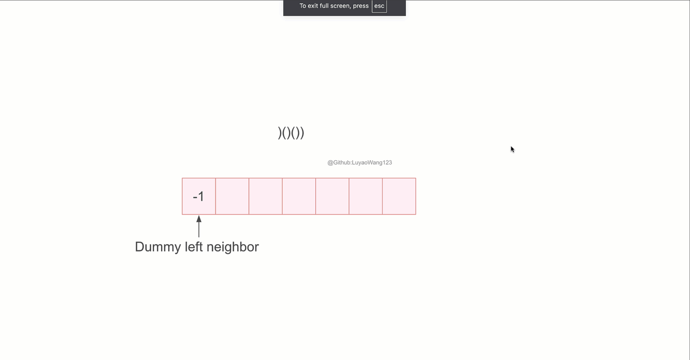

# Documentation for Data Structure
This file serves as the documentation for data structure.
Data structure is way to organize data based on specific rules.

## Stack

[Stack](/data_structures/stack/Stack.java) is a data structure that follows **First In, Last Out(FIFO)**. Namely, the element being pushed first will be the one that is last popped out. 
<figure style="text-align: center;">
  
  <figcaption>
    <strong>Figure 1.</strong> Stack Mechanism 
  </figcaption>
</figure>

In this mechanism demonstration, we set topPtr to be -1(which means the bottom of the stack) for stack initialization.
+ If we **push** one element into stack, (after check overflow)we first increment stack's top pointer, 
then assign the value to where the pointer points. 
+ If we **pop**
one element from stack, (after check underflow) we first decrement stack's top pointer, then return what 
the pointer + 1 points to.

### Time Complexity
| Operation | Time Complexity |
|-----------|-----------------|
| push      | O(1)          |
| pop       | O(1)          |
| peek/top  | O(1)          |
| isEmpty   | O(1)          |

### Practice
#### [Leetcode 20(Easy). Valid Parentheses](https://leetcode.com/problems/valid-parentheses/description/)
##### Description:
Given a string s containing just the characters '(', ')', '{', '}', '[' and ']', determine if the input string is valid.

An input string is valid if:

+ Open brackets must be closed by the same type of brackets.
+ Open brackets must be closed in the correct order.
+ Every close bracket has a corresponding open bracket of the same type

##### Solution:
 For each character in this string, it is **either** open parentheses or a closed parentheses. 
+ if it is a open parentheses, then this parentheses needs to be matched in the future, so we store it in the stack(we use stack here, as we want future closed parentheses to match the closet open parentheses on its left--the most recent open parentheses that is pushed in to stack)
+ if it is a closed parentheses, then we check the top of stack to see if there is a match open parentheses. If there is a match, then pop this matched open parentheses then we go to the next character; otherwise, this is not a valid string, as there is a closed parentheses that does not have matched open parentheses.

After iteration, we still need to check if the stack is empty, as if it is not empty, then there are some open parentheses not get matched, thus not valid either.

##### [Code](/src/main/java/data_structures/stack/ValidParentheses.java)

##### Complexity:
$n$ is the length of the string input

Time Complexity: $O(n)$, as we iterate through the whole string, each character in the string is accessed once

Space Complexity: $O(n)$, as we are using stack, whose size might go up to the whole string

For problem 20, it is just judging the if all open and closed parentheses get matched. Then based on
the fact that they are matched, we can also compute the properties of such matched(balanced) string input. 
For example, problem 856:

#### [Leetcode 856(Medium). Score of Parentheses](https://leetcode.com/problems/score-of-parentheses/description/)
##### Description:
Given a **balanced** parentheses string s, return the score of the string.

The score of a balanced parentheses string is based on the following rule:

+ "()" has score 1.
+ AB has score A + B, where A and B are balanced parentheses strings.
+ (A) has score 2 * A, where A is a balanced parentheses string.

##### Solution: 
Before calculating the score of the input, we initialize the stack by pushing 0(the current value of the input)
Then for each character in the string, it is either '(' or ')':
+ If the character is '(', then it is a new nested layer, for example, a string with "(())" has layer depth 2,
while a string "((()()))" has a depth 3, as there are at most 3 unmatched ((( appear together, 
either (((, or ((()(. Each time for  a new layer, we push 0 to the stack indicating that 
this is a new layer;
+ If the character is ')', it ends a nested layer. As we end the layer, 
we will need to double the score of the nested string by rule 3. When we finish the nesting calculation,
we also need to add this string's score to the left adjacent nested string in the same depth, which is rule 2. 
For example, (ABC), where A, B, and C are all balanced parentheses strings, and A, B, and C have the same depth. 
  + Thus when we find the score of A, we will add score A to score (, which is 0, and get a score $score_{(A}$;
  + Then when we find the score of B, we will add score B to $score_{(A}$, get $score_{(AB}$, 
  + Then when we find the score of C, we will add score C to $score_{(AB}$, get $score_{(ABC}$
  + then we have ), that means we need to double the score of $ABC$, then push it to stack 

In short, by popping 2 values from the stack and pushing 1 value in the stack when we encounter ')', 
we finish the match this ')' to the most recent open parenthesis, and by adding the result to
the second recent open parenthesis, we make this second parenthesis to be the most recent unmatched 
open parenthesis **and** compute the nest string score. 

Here is an animation(too small? [original slides](/src/main/resources/856_score_of_parentheses.pptx))
<figure style="text-align: center;">
  
  <figcaption>
    <strong>Figure 2.</strong> Score of parentheses example animation 
  </figcaption>
</figure>

##### [Code](/src/main/java/data_structures/stack/ScoreOfParentheses.java)

##### Complexity:
Time Complexity is $O(n)$ where n is the length of parentheses input;
Space Complexity is $O(n)$ 

So far, we've discussed about how to judge valid parentheses, 
and based on valid parentheses, compute the value of nested layers of parentheses(nested--double, same depth--addition) using stacks. Now, what if we want to know the longest valid length for a parentheses input? This is the next problem:

#### [Leetcode 32(Hard). Longest Valid Parentheses](https://leetcode.com/problems/longest-valid-parentheses/)

##### Description
Given a string containing just the characters '(' and ')', return the length of the longest valid (well-formed) parentheses substring.

#### [Leetcode 32 (Hard): Longest Valid Parentheses](https://leetcode.com/problems/longest-valid-parentheses/)

##### Problem Description
Given a string consisting solely of the characters '(' and ')', determine the length of the longest valid (well-formed) substring of parentheses.

##### Approach and Explanation
To solve this problem, our goal is to find the maximum length of a valid substring. A key insight is to use a stack to track the potential start indices of valid parentheses. This allows us to easily calculate the length of valid parentheses substrings as we parse through the input string.

Here is the step-by-step logic:

1. **Initialization:**  
   Begin by pushing `-1` onto the stack. This dummy index helps handle edge cases smoothly. Specifically, it allows us to compute the length of valid substrings starting at index 0 without needing separate handling.

2. **Iterating Through the String:**  
   For each character in the string:
   - **If the character is '(':**  
     Push its index onto the stack. This indicates the start of a potential new valid substring.
   - **If the character is ')':**  
     Pop the top index from the stack, which corresponds to the most recent unmatched '('.
     - **If the stack is empty after the pop:**  
       This indicates that there are more ')' than '(' up to the current position. In this case, push the current index onto the stack. This current index now acts as a new reference point (or left boundary) for future valid substrings.
     - **If the stack is not empty:**  
       Compute the length of the current valid substring by subtracting the new top index of the stack from the current index (i.e., `current_index - stack.peek()`). Update the maximum length if this value is larger than the previously recorded maximum. Do not push the new ')' index to stack as this valid parentheses are still growing.

This method efficiently calculates the valid substring length by dynamically tracking unmatched parentheses using the stack.

##### Visualization
An animation is available to help visualize the process. *(Note: If the animation appears too small, consider using the [original slides](/src/main/resources/32_longest_valid_parentheses.pptx) for a larger view.)*

<figure style="text-align: center;">
  
  <figcaption>
    <strong>Figure 2.</strong> Longest valid parentheses example animation 
  </figcaption>
</figure>

##### Code

##### Complexity
Time Complexity is $O(n)$

Space Complexity is $O(n)$

So far, we have seen how to use stack to keep track of indices to compute the length. A similar problem is [739. Daily Temperatures](https://leetcode.com/problems/daily-temperatures/), which is we store the index in a stack if the current element arr[i] contributes to a non-increasing sequence, otherwise, arr[i] contributes to an increasing sequence, that means arr[i] is the first warmer day for whatever value $j$ in the stack such that $arr[j] < arr[i]$. Another similar problem is [84. Largest Rectangle in Histogram](https://leetcode.com/problems/largest-rectangle-in-histogram/), this is the problem in that we store indices of non-decreasing elements. If $height[i]$ contributes to decreasing sequence, then we need to calculate the rectangle whose width ends at $i-1$ and starts at $j$(such that $height[j]\geq height[i]$). [More stack problems](/leetcode_practice.md#stack).