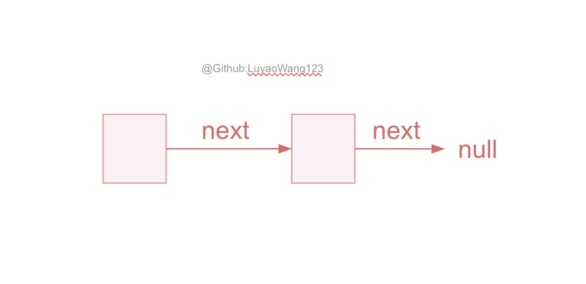
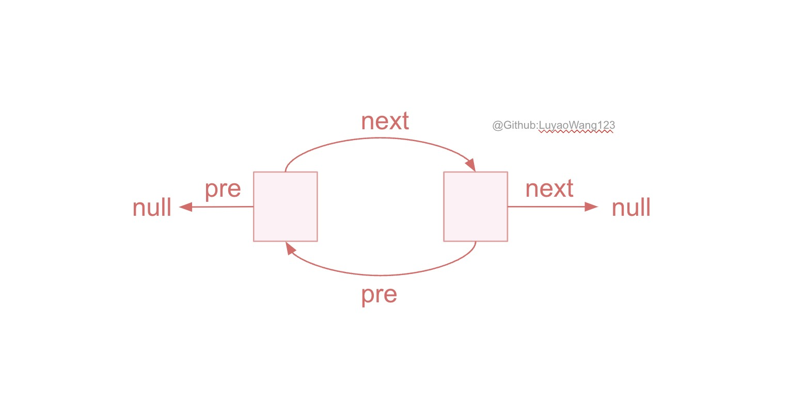
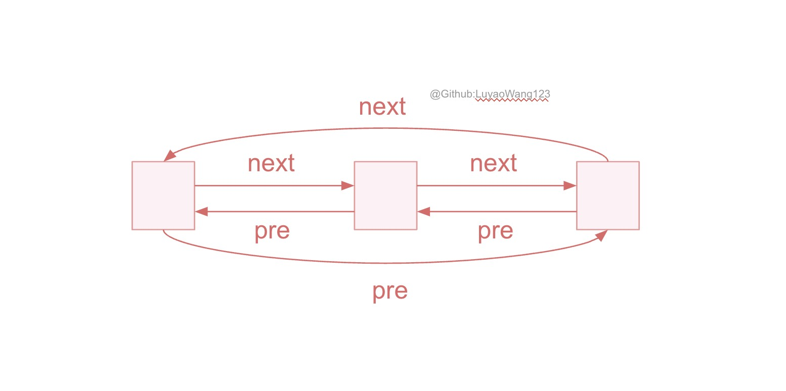

# LinkedList
## Table of Contents
- [Description](#description)
- [Algorithm Complexity](#complexity)
- [Practice](#practice)
  - [206. Reverse Linked List](#leetcode-346easy-moving-average-from-data-stream)

## Description
*LinkedList*(*search list*)([implementation](/src/main/java/data_structures/linkedlist/DoublyLinkedList.java)) is a data structure that stores elements in linear order. LinkedList is similar to as array, but it accesses element by points: 

+ *Singly linked list*: each element has only ```next``` pointer 
<figure style="text-align: center;">
  
  <figcaption>
    <strong>Figure 1.</strong> singly linked list<br>
  </figcaption>
</figure>

+ *Doubly linked list*: each element has ```next``` and ```pre``` pointers 
<figure style="text-align: center;">
  
  <figcaption>
    <strong>Figure 2.</strong> doubly linked list<br>
  </figcaption>
</figure>

For each node $x$ in a linked list, we call:
+ $x\rightarrow pre$: x's *predecessor*
+ $x\rightarrow next$: x's *successor*. 
+ If $x\rightarrow pre$ is null(equivalently, $x$ is the first node in linked list), then node $x$ is *head*; 
+ If $x\rightarrow next$ is null(equivalently, $x$ is the last node in linked list), then node $x$ is *tail*.

Then observe the linked list, if $tail.next$ points to $head$, while $head.pre$ points to the tail like Figure 3, then we have *a circular linked list*!

<figure style="text-align: center;">
  
  <figcaption>
    <strong>Figure 3.</strong> circular linked list<br>
  </figcaption>
</figure>

## Complexity
+ `prepend()`: insert a node to head
+ `insert(x,y)`: insert node $x$ immediately after $y$
+ `search(k)`: search node whose data is $k$ in linked list
+ `remove(x)`: remove node $x$ in linked list

| Operation | Time Complexity |
|-----------|-----------------|
| prepend      | $O(1)$          |
| insert       | $O(1)$          |
| search       | $O(n)$          |
| delete       | $O(1)$          |

## Practice
### [Leetcode 206(Easy). Reverse Linked List](https://leetcode.com/problems/reverse-linked-list/)

#### Description
Given the head of a singly linked list, reverse the list, and return the reversed list.

#### Solution
For this problem, we want to change the pointer direction of the node, specifically, $1\rightarrow2$ to $2\leftarrow 1$. To solve this problem better, we denote 

+ $pre$ to be the pointer that all nodes before $pre$ has been reversed, equivalently, $pre$ is the head of the reversed list.
+ $cur$ to be the node that we need to reverse, we want $cur\rightarrow next$ to become $cur\rightarrow pre$. Then we update the $cur$ and $pre$ pointer. As we lost access to $cur\rightarrow next$ when we change the direction, we can't change the direction. To avoid this, we use:
+ $next$ to store the cur's next **before** we change the direction so that we can update the $cur$ and $pre$ after we reverse.


#### [Code]()

#### Complexity
As the reverse operation only takes constant time: $O(1)$, and there are $n$ nodes in our input, thus this algorithm will take $O(n)$ time complexity.