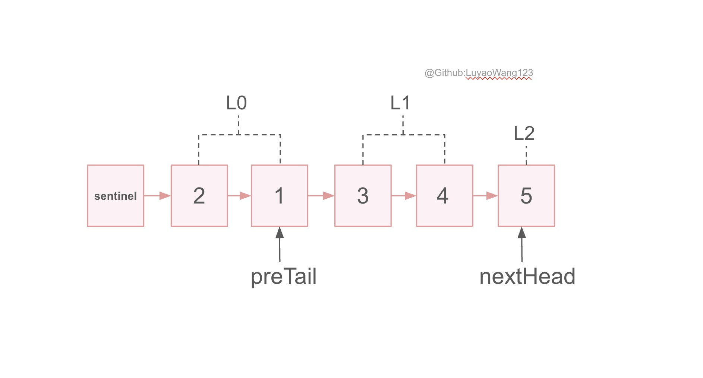

# LinkedList
## Table of Contents
- [Description](#description)
- [Algorithm Complexity](#complexity)
- [Practice](#practice)
  - [206. Reverse Linked List](#leetcode-346easy-moving-average-from-data-stream)
  - [876. Middle of the Linked List](#leetcode-876easy-middle-of-the-linked-list)
  - [61. Rotate List](#leetcode-61medium-rotate-list)
  - [25. Reverse Nodes in k-Group](#leetcode-25hard-reverse-nodes-in-k-group)

## Description
*LinkedList*(*search list*)([implementation](/src/main/java/data_structures/linkedlist/DoublyLinkedList.java)) is a data structure that stores elements in linear order. LinkedList is similar to as array, but it accesses element by points: 

+ *Singly linked list*: each element has only ```next``` pointer 
<figure style="text-align: center;">
  
  <figcaption>
    <strong>Figure 1.</strong> singly linked list<br>
  </figcaption>
</figure>

+ *Doubly linked list*: each element has ```next``` and ```pre``` pointers 
<figure style="text-align: center;">
  
  <figcaption>
    <strong>Figure 2.</strong> doubly linked list<br>
  </figcaption>
</figure>

For each node $x$ in a linked list, we call:
+ $x\rightarrow pre$: x's *predecessor*
+ $x\rightarrow next$: x's *successor*. 
+ If $x\rightarrow pre$ is null(equivalently, $x$ is the first node in linked list), then node $x$ is *head*; 
+ If $x\rightarrow next$ is null(equivalently, $x$ is the last node in linked list), then node $x$ is *tail*.

Then observe the linked list, if $tail.next$ points to $head$, while $head.pre$ points to the tail like Figure 3, then we have *a circular linked list*!

<figure style="text-align: center;">
  
  <figcaption>
    <strong>Figure 3.</strong> circular linked list<br>
  </figcaption>
</figure>

## Complexity
+ `prepend()`: insert a node to head
+ `insert(x,y)`: insert node $x$ immediately after $y$
+ `search(k)`: search node whose data is $k$ in linked list
+ `remove(x)`: remove node $x$ in linked list

| Operation | Time Complexity |
|-----------|-----------------|
| prepend      | $O(1)$          |
| insert       | $O(1)$          |
| search       | $O(n)$          |
| delete       | $O(1)$          |

## Practice

### [Leetcode 206(Easy). Reverse Linked List](https://leetcode.com/problems/reverse-linked-list/)

#### Description
Given the head of a singly linked list, reverse the list, and return the reversed list.

#### Solution
For this problem, we want to change the pointer direction of the node, specifically, $1\rightarrow2$ to $2\leftarrow 1$. To solve this problem better, we denote 

+ $pre$ to be the pointer that all nodes before $pre$ has been reversed, equivalently, $pre$ is the head of the reversed list.
+ $cur$ to be the node that we need to reverse, we want $cur\rightarrow next$ to become $cur\rightarrow pre$. Then we update the $cur$ and $pre$ pointer. As we lost access to $cur\rightarrow next$ when we change the direction, we can't change the direction. To avoid this, we use:
+ $next$ to store the cur's next **before** we change the direction so that we can update the $cur$ and $pre$ after we reverse.


#### [Code](/src/main/java/data_structures/linkedlist/ReverseLinkedList.java)

#### Complexity
As the reverse operation only takes constant time: $O(1)$, and there are $n$ nodes in our input, thus this algorithm will take $O(n)$ time complexity.

### [Leetcode 876(Easy). Middle of the Linked List](https://leetcode.com/problems/middle-of-the-linked-list/)

#### Description
Given the head of a singly linked list, return the middle node of the linked list.

If there are two middle nodes, return the **second middle node**.

#### Solution
We want to find the middle node in a singly linked list, which means we cannot directly access it by calling its index: $\lfloor |arr|/2\rfloor$.
+ The most intuitive approach would be to iterate through this whole list to get the size $|arr|$ of this linked list, then get the index: $\lfloor |arr|/2\rfloor$, then iterate through the list and count the index until the index meets $\lfloor |arr|/2\rfloor$, then the node where they meet is the result. 

The above intuitive approach might lead to $O(n)$ time. Is there any way that we can finish this algorithm with only one pass instead of two?

+ One improved approach is to set up a fast pointer and a slower pointer. Every time we increase the slower pointer by one, we increase the faster pointer by two. In this way, when the faster pointer hits the end of the linked list, the node that our slower pointer points to is the target node.  
  
  + Should we set the initial value of the slow pointer and faster pointer to directly $head$ or $head.next$? 
      + first middle node: set to $head$
      + second middle node: set to $head.next$
      + eg. $1\rightarrow 2 \rightarrow 3 \rightarrow 4$, the first middle node is 2, the second middle node is 3

The second approach needs only one pass, leading to $O(n)$ time complexity as well, but it will be faster than the first approach as the first approach takes $O(2*n)$ time complexity.


#### [Code](/src/main/java/data_structures/linkedlist/MiddleOfLinkedList.java)

#### Complexity
The first approach takes $O(2*n)=O(n)$ time complexity, as it is a 2-pass algorithm, we are iterating through the linked list twice. Space complexity is $O(1)$;

The second approach takes $O(n)$ time complexity, it is only a 1-pass algorithm, with $O(1)$ space complexity.

### [Leetcode 61(Medium). Rotate List](https://leetcode.com/problems/rotate-list/)
#### Description
Given the head of a linked list, rotate the list to the right by k places.

#### Solution
The central idea of this problem is to cut one linked list $L$ into two linked lists $L_1:L_2$, the size of which is $|L|-k$ and $k$. Then, the two lists are rearranged to $L_2:L_1$.

As our $k$ might be larger than n(this leads to a circle when we try to find where to cut), one approach to solve this is to 

+ Iterate through with this SinglelyNode, and get the size $|L|$ of the linked list $\to O(n)$ time complexity
+ $k=k\% |L|$
+ Find the place(($|L|-k-1$)-th node) to cut the linked list $\to O(n)$ time complexity
+ Append $L_1$ to $L_2$

However, this led to a 2-pass approach. Do we have a 1-pass approach?
+ Fix a window with size $k$ on linked list:
  + First set the fast pointer to head, then move it to the k-th node, then set the slow pointer to head(there will be $k-1$ elements between fast and slow pointer, not including fast and slow themselves) 
  + If $k>n$, then when faster pointer hits the last node, we set it to head(start from head again) 
+ Move the fast and slow pointer together until the fast pointer hits the last element, then slow.next will be the place to cut
  + As there are $k-1$ nodes between slow and fast pointers, after the slow pointer, there will be $k$ nodes in total(only including the fast pointer now)
+ Re-arrange the 2 lists. 

#### [Code](/src/main/java/data_structures/linkedlist/RotateList.java)

#### Complexity
The first approach takes $O(n)$ time complexity, $O(1)$ space complexity. 

The second approach takes the same time complexity and space complexity, but it is faster than the first approach as it is one pass.

### [LeetCode 25(Hard). Reverse Nodes in k-Group](https://leetcode.com/problems/reverse-nodes-in-k-group/)
#### Description
Given the head of a linked list, reverse the nodes of the list k at a time, and return the modified list.

k is a positive integer and is less than or equal to the length of the linked list. If the number of nodes is not a multiple of k then left-out nodes, in the end, should remain as it is.

You may not alter the values in the list's nodes, only nodes themselves may be changed.

#### Solution
The central idea of this problem is to cut one linked list $L$ into $\lceil \frac{|L|}{k} \rceil$ linked lists $L_1:L_2:L_{\cdots}, :L_{\lceil \frac{|L|}{k} \rceil}$ such that the size of each linked list is $k$ except for the last linked list $L_{\lceil \frac{|L|}{k} \rceil}$ whose size might be smaller than $k$. Then for each $L_i$ we need to reverse it. Then connect them together again. 

As in problem 206, we already know how to reverse a linked list, we can reuse it here, we need to pass $L_i$'s head then we will get a reversed linked list, and then we put this reversed linked list back to the original linked list by setting $L_{i-1}$'s next to $L_i$'s reversed head, and setting $L_i$'s next to $L_{i+1}$'s head. We can demonstrate the process better with Figure 4 below
<figure style="text-align: center;">
  
  <figcaption>
    <strong>Figure 4.</strong> reverse nodes in k-group<br>
  </figcaption>
</figure>

+ Set the $ptr$ to sentinel, and $ptr$'s index $i$ to be 0. 
  + iterate through the singly linked list, if there $i\neq 0$ and $i\% k=0$, then it is the end of $L_i$
  + We then have $L_i$'s head to be $preTail.next$, $L_i$'s tail to be $ptr$, $L_{i+1}$'s head to be $ptr.next$
    + Set $ptr.next = null$
    + Pass $L_i$'s head to method reverse, getting the reversed head, and we know the reversed tail is $L_i$'s original head.
  + Set $preTail.next$ to be reversed head, $L_i$'s reversed tail's next to be $L_{i+1}$'s head 
  + update $preTail$ and $ptr$

Following what we talked about, we have the code below.

#### [Code](/src/main/java/data_structures/linkedlist/ReverseNodesInKGroup.java)

#### Complexity
The time complexity for this problem is $O(n)$ where $n=|L|$ as each node is at most accessed twice(iteration takes once, the reverse operation takes once). The space complexity for this problem is $O(1)$, we did not create extra space for this problem.