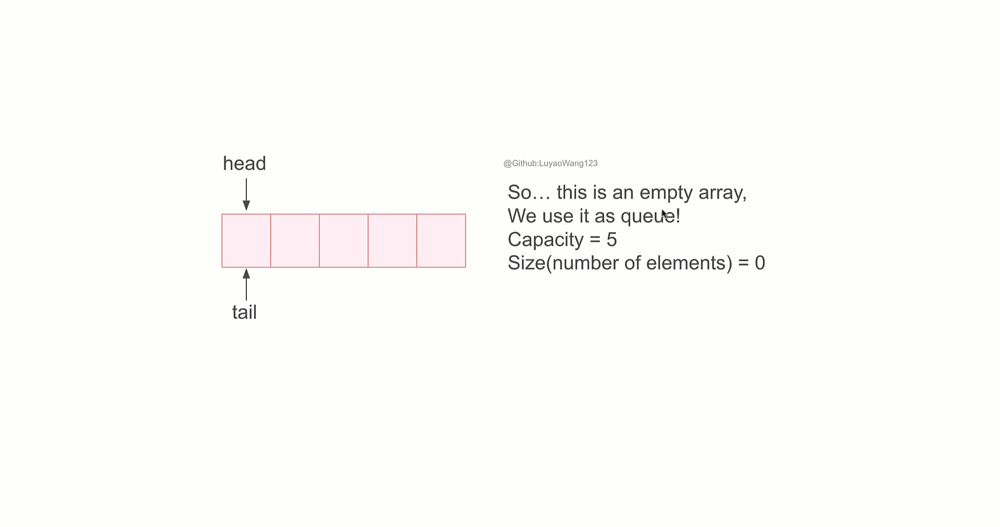

# Queue
## Table of Contents
- [Description](#description)
- [Algorithm Complexity](#complexity)
- [Practice](#practice)
## Description
Queue[(Implementation)](/src/main/java/data_structures/queue/Queue.java) is a data structure that follows **First In, First Out(FIFO)**. Namely, the element being pushed first will be the one that is first popped out.

<figure style="text-align: center;">
  
  <figcaption>
    <strong>Figure 3.</strong> Queue Mechanism(<a href="../src/main/resources/queue.pptx">Slides</a>) 
  </figcaption>
</figure>

In this mechanism demonstration, we set 
+ $tail = 0$ (where the element reside when enqueue)
+ $head = 0$ (where the element reside when dequeue)
+ $size = 0$ (number of element in the queue)

for queue initialization.

+ If we enqueue one element into queue, (after check overflow), we first assign the value to where $tail$ points, then increment $tail$ by one. We treated the array as circular array, so if $tail$ already hits capacity, we move $tail$ to 0.
+ If we dequeue from queue, (after check underflow), we first store head element to $x$, then increment $head$ by one. Similarly to enqueue, wrap around $head$ when it hits capacity, we move $head$ to 0.

Queue's implementation--first assign value then increment pointer for add operation--follows [Introduction to Algorithm](https://www.google.com/books/edition/Introduction_to_Algorithms_fourth_editio/RSMuEAAAQBAJ?hl=en&gbpv=0). We can also first increment pointer then assign value, this is what [Algorithm](https://www.google.com/books/edition/Algorithms/MTpsAQAAQBAJ?hl=en&sa=X&ved=2ahUKEwipstXqi-iLAxWIjYkEHW8_AccQiqUDegQIDRAH) did.

## Complexity
| Operation | Time Complexity |
|-----------|-----------------|
| enqueue      | O(1)          |
| dequeue       | O(1)          |

## Practice