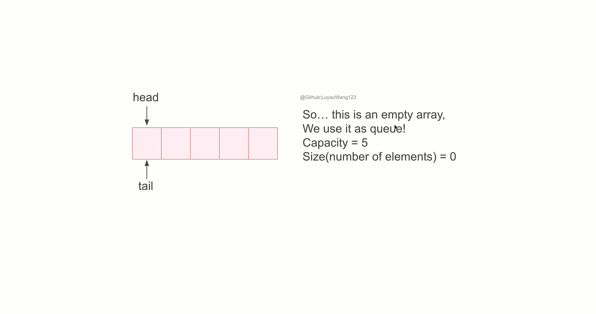

# Queue
## Table of Contents
- [Description](#description)
- [Algorithm Complexity](#complexity)
- [Practice](#practice)
  - [Leetcode 346. Moving Average from Data Stream](#leetcode-346easy-moving-average-from-data-stream)
  
## Description
Queue[(Implementation)](/src/main/java/data_structures/queue/Queue.java) is a data structure that follows **First In, First Out(FIFO)**. Namely, the element being pushed first will be the one that is first popped out.

<figure style="text-align: center;">
  
  <figcaption>
    <strong>Figure 3.</strong> Queue Mechanism(<a href="./slides/queue.pptx">Slides</a>) 
  </figcaption>
</figure>

In this mechanism demonstration, we set 
+ $tail = 0$ (where the element reside when enqueue)
+ $head = 0$ (where the element reside when dequeue)
+ $size = 0$ (number of element in the queue)

for queue initialization.

+ If we enqueue one element into queue, (after check overflow), we first assign the value to where $tail$ points, then increment $tail$ by one. We treated the array as circular array, so if $tail$ already hits capacity, we move $tail$ to 0.
+ If we dequeue from queue, (after check underflow), we first store head element to $x$, then increment $head$ by one. Similarly to enqueue, wrap around $head$ when it hits capacity, we move $head$ to 0.

Queue's implementation--first assign value then increment pointer for add operation--follows [Introduction to Algorithm](https://www.google.com/books/edition/Introduction_to_Algorithms_fourth_editio/RSMuEAAAQBAJ?hl=en&gbpv=0). 

## Complexity
| Operation | Time Complexity |
|-----------|-----------------|
| enqueue      | O(1)          |
| dequeue       | O(1)          |

## Practice
### [Leetcode 346(Easy). Moving Average from Data Stream](https://leetcode.com/problems/moving-average-from-data-stream/)
#### Description
Given a stream of integers and a window size, calculate the moving average of all integers in the sliding window.

Implement the MovingAverage class:

+ MovingAverage(int size) Initializes the object with the size of the window size.

+ double next(int val) Returns the moving average of the last size values of the stream.

#### Solution
For this problem, as we have a window of fixed length, and we want to keep track of the sum for this window, namely, $\sum_{i=0}^{n} queue[i]$, where $n< size$. The problem is we just want to keep the most recent $size$ elements, so if the element we add to the queue is the $size-th$ element, we will then want to remove the $0-th$ element, so that the queue will only keep the most recent $size$ elements.

Following the idea, we have the code as below:

#### [Code](/src/main/java/data_structures/queue/MovingAverage.java)

#### Complexity
$size$ is the window size, and $n$ is the input size for next, then we will have:

Time Complexity: $O(n)$, this is linear as we need to iterate all input for next processing

Space Complexity: $O(size)$, we are using queue to keep the most recent $size$ elements. As we only need to store the most recent $size$ elements, thus the queue with size $size$ will be enough, leading to space complexity $O(size)$