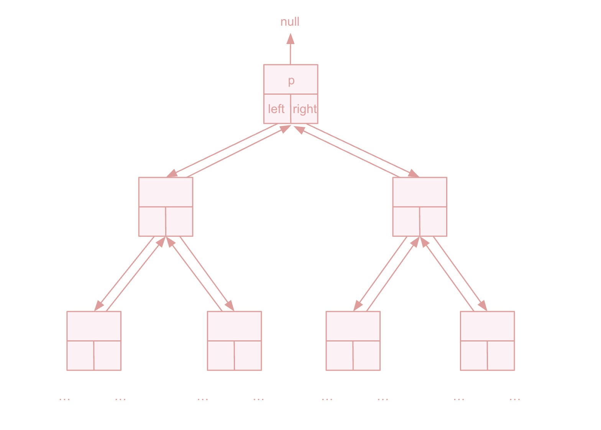

# Tree
## Table of Contents
- [Description](#description)
- [Algorithm Complexity](#complexity)
- [Trees](#tree)
  - [Binary Tree](#binary-tree)
  - [Binary Search Tree](#binary-search-tree)

## Description
We talked about Linked List, but not all relationships are linear, thus Tree is introduced. 

We can use 
+ *p*: parent pointer of node
+ *left*: node's left child
+ *right*: node's right child
+ *key*: the value of the node storing
+ *right sibling*: for node $x_i$, there exist a $x_{i+1}$ such that $x_i\to p\to x_{i+1}$, then $x_{i+1}$ is the right sibling of $x_i$
+ *left sibling*: for node $x_i$, there exist a $x_{i-1}$ such that $x_{i}\to p\to x_{i-1}$, then $x_{i-1}$ is the left sibling of $x_i$ 

to represent the binary tree(binary means 2 children here, Namely, left and right). If a node's parent is null, then this node is the *root* of the tree(Info comes from Intro to Algorithms Edition4).

Figure 1 shows how Tree represents the data conceptually. 

<figure style="text-align: center;">
  
  <figcaption>
    <strong>Figure 1.</strong> rooted binary tree 
  </figcaption>
</figure>

To be more general, the rooted tree might not just have 2 children, it might have more children, thus we have rooted trees with unbounded branching: the number of children of each node is at most some constant $k$. So we can have $child_1$, $child_2$, $\cdots$, $child_{k}$.

Besides using pointers representing Tree, we can also use an index. For example, in a heap, we will use index $2k+1$ to represent index $k$'s left child, and index $2k+2$ to represent index $k$'s right child. Or in some coding problems, we might be giving an input $parent[i]$ represent $i$'s parent. Overall, the pointer-based representation is still the most common form for tree representation.

As Tree might have multiple representations, we implement the most commonly used smallest unit--[Binary Tree Node Without Parent](/src/main/java/data_structures/tree/TreeNode.java), and [Binary Tree Node With Parent](/src/main/java/data_structures/tree/TreeNodeWithParent.java).

## Trees
### Binary Tree
As discussed in the description, the binary tree has only 2 children, left and right. 

Depending on the need, there might be a *parent* filed. For this binary tree section, consider that binary tree is more common in the coding practice instead of the implementation, so we will skip the implementation, focusing on the coding practice.

#### Complexity
+ `insert(x)`: insert a node $x$ to a given binary tree

+ `search(x)`: search a node $x$ in a given binary tree

+ `remove(x)`: remove a node $x$ in a given binary tree

| Operation | Time Complexity |
|-----------|-----------------|
| insert       | $O(n)$          |
| search       | $O(n)$          |
| remove       | $O(n)$          |

#### Practice

### Binary Search Tree